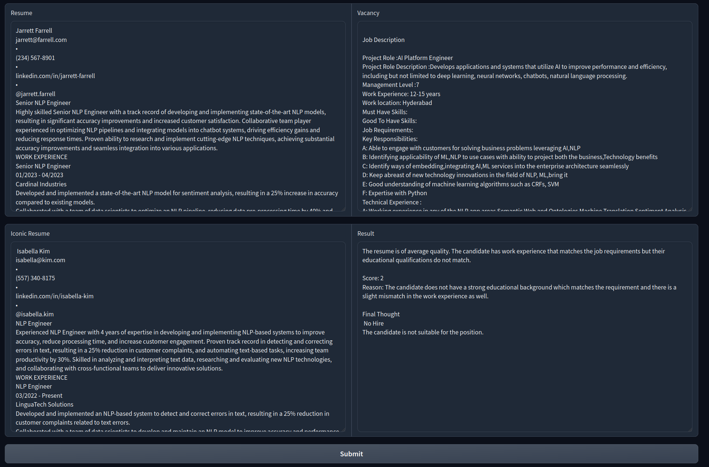

# nlp_in_practice
## Установка зависимостей
Минимальная версия python: 3.10
```bash
pip install -r requirements.txt
```
Установка `llama-cpp` с использованием cuda:
```bash
CMAKE_ARGS="-DLLAMA_CUBLAS=on" FORCE_CMAKE=1 pip install --upgrade --force-reinstall llama-cpp-python --no-cache-dir
```
Скачивание модели:
```bash
wget https://huggingface.co/Samoed/resume_llm_merged-gguf/resolve/main/model_with_lora-q2_k.gguf -P ./model
```

## Запуск
```bash
python src/main.py
```

## Демо


## Производительность
Генерация ответа на:
- CPU: 6 минут
- GPU: 30 секунды

## Проведены эксперименты
1) Prompt engineering — Chain of Thoughts, Role play, общая чувствительность запроса к модели.
2) Дообучение модели на размеченных резюме и сравнение результатов.

## Данные
Были взяты [данные](https://www.kaggle.com/datasets/mukund23/a-perfect-fit). PDF-резюме были сконвертированы в текст. 

## Обучение модели
Модель обучалась с помощью Supervised Fine-tuning на промпте:
```python
f"Target resume: {example['target_resume']}\n### Input resume: {example['resume_text']}\n### Score: {example['Match Percentage']}"
```