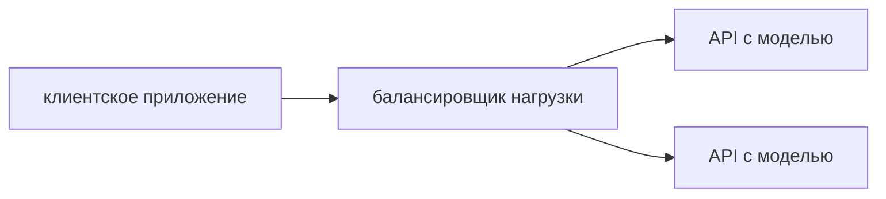

# nlp_in_practice
## Установка зависимостей
Минимальная версия **python3.10**
```bash
pip install -r requirements.txt
```
Установка `llama-cpp` с использованием cuda:
```bash
CMAKE_ARGS="-DLLAMA_CUBLAS=on" FORCE_CMAKE=1 pip install --upgrade --force-reinstall llama-cpp-python --no-cache-dir
```
Скачивание модели:
```bash
wget https://huggingface.co/Samoed/resume_llm_merged-gguf/resolve/main/model_with_lora-q2_k.gguf -P ./model
```

## Запуск
```bash
python src/main.py
```

## Демо


## Производительность
Генерация ответа на:
- CPU: 6 минут (Intel i7-11370H (8) @ 4.800GHz)
- GPU: 30 секунд (GeForce RTX 3050)

## Проведены эксперименты
1) Prompt engineering — Chain of Thoughts, Role play, общая чувствительность запроса к модели.
2) Сравнение моделей OpenChat, OpenOrca -> ОpenOrca значительно лучше справляется с семантическими цепочками в сравнениях резюме.
3) SFT адаптера на данных резюме -> повышение оценивающей способности модели.
4) Подбор параметров генерации -> температура, параметры лучевого поиска и сэмплирования оптимальны для уменьшения галлюцинаций.

| do_sample| num_beams | early_stopping | temperature | penalty_alpha | max_new_tokens | top_p | top_k |
| -------- | -------   | -------        | -------     | -------       | -------        | ------| ----- |
| True     | 5         | True           | 0.2         | 0.6           | 512            | 0.95  | 15    |
 

## Данные
Были взяты [данные](https://www.kaggle.com/datasets/mukund23/a-perfect-fit). PDF-резюме были сконвертированы в текст.

## Обучение модели
Модель обучалась с помощью Supervised Fine-tuning на промпте:
```python
f"Target resume: {example['target_resume']}\n### Input resume: {example['resume_text']}\n### Score: {example['Match Percentage']}"
```

## Масштабирование
При масштабировании приложения можно добавить API к модели, к которому будет обращаться клиетское обращение, и балансировщик нагрузки, который будет распределять запросы по различным копиям сервиса с моделями.


